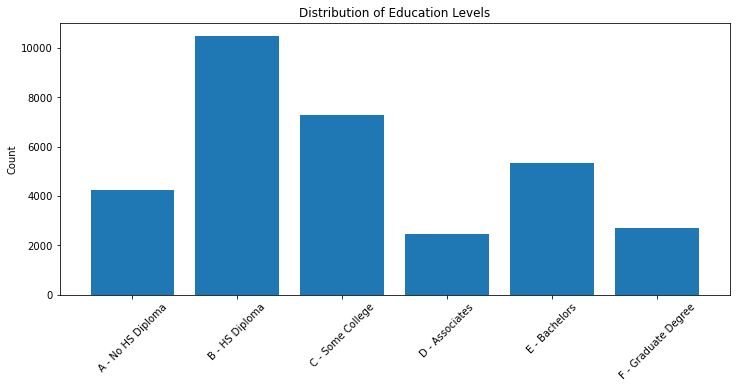

# Data Serialization Formats Checkpoint

This checkpoint is designed to test your understanding of the content from the Data Serialization Formats Cumulative Lab.

Specifically, this will cover:

* Reading serialized CSV data from a file into a Python object
* Extracting information from nested data structures

## Your Task: Extract Frequency Counts for Education Levels from a CSV

### Data Understanding

In this repository there is a CSV data file, `salaries.csv`, containing salary and demographic information. When loaded into Python as a list of dictionaries, each dictionary looks something like this:

```
{
  'Age':          '39',
  'Education':    'E - Bachelors',
  'Occupation':   'Adm-clerical',
  'Relationship': 'Not-in-family',
  'Race':         'White',
  'Sex':          'Male',
  'Target':       '<=50K'
 }
```

Most of this information is irrelevant for the current task; the one piece that you need to focus on is the `Education` key-value pair.

Your task is to create a **frequency table** where the various education levels (values associated with the `Education` keys) are encoded as keys, and the frequencies of those education levels are encoded as values.

### Requirements

#### 1. Import the Relevant Module

#### 2. Open the File and Create a List of Records

#### 3. Identify the Unique Education Levels

#### 4. Create a Frequency Table of Education Levels

#### 5. Identify the Most Common Education Level

## 1. Import the Relevant Module

In the cell below, import the module used for working with CSV data in Python:


```python
# CodeGrade step1
# Your code here!

```

## 2. Open the File and Create a List of Records

Make sure you follow these steps with the specified variable names in order to pass all tests:

1. Create a file object `salary_data_file` by opening the file with the path to your copy of `salaries.csv`
2. Instantiate a `DictReader` ([documentation here](https://docs.python.org/3/library/csv.html#csv.DictReader)) using that file object
3. Cast the `DictReader` to a `list` and assign the result to `salary_data`
4. Close the `salary_data_file`


```python
# CodeGrade step2
# Replace None with appropriate code

# Open the file
salary_data_file = None

# Instantiate a DictReader and create salary_data
salary_data = None

# Close salary_data_file
None

# Visually inspecting the first few records
for record in salary_data[:5]:
    print(record)
```


```python
# Checking salary_data_file
assert type(salary_data_file) != None

# Checking salary_data
assert type(salary_data) == list
```

## 3. Identify the Unique Education Levels

Create a list `unique_education_levels` that contains all unique values associated with the `Education` key in these records, in alphabetical order.

***Hint:*** You'll need to loop over all records (dictionaries) in `salary_data` and find the value associated with the `Education` key for each

***Hint:*** The `.sort` list method or `sorted` built-in function can be used to sort strings into alphabetical order. Note that `.sort` modifies the list in place and returns `None`, whereas `sorted` does not modify the list in place but returns a sorted version.


```python
# CodeGrade step3
# Replace None with appropriate code (adding more lines as needed)

unique_education_levels = None

print("Unique Education Levels:")
print(unique_education_levels)
```


```python
# Checking unique_education_levels
assert type(unique_education_levels) == list
assert len(unique_education_levels) == 6
```

## 4. Create a Frequency Table of Education Levels

Create a dictionary `education_level_frequencies` where the keys are the unique education levels found above, and the values are the number of times that the education level appeared in the full dataset.

For example, the key `A - No HS Diploma` should have the associated value `4253`, since that education level appears 4,253 times in the dataset.


```python
# CodeGrade step4
# Replace None with appropriate code (add more lines as needed)

education_level_frequencies = None

print("The most common education level appears", max(education_level_frequencies.values()), "times")
print("The least common education level appears", min(education_level_frequencies.values()), "times")
```


```python
# Run this cell without changes

x = list(education_level_frequencies.keys())
height = list(education_level_frequencies.values())

# Checking education_level_frequencies

# Should be a dictionary overall
assert type(education_level_frequencies) == dict

x = list(education_level_frequencies.keys())
height = list(education_level_frequencies.values())

# Should have string keys
assert type(x[0]) == str
# Should have integer values
assert type(height[0]) == int

# This plotting code should work
import matplotlib.pyplot as plt
fig, ax = plt.subplots(figsize=(12, 5))
ax.bar(x, height)
ax.tick_params(axis='x', labelrotation=45)
ax.set_title("Distribution of Education Levels")
ax.set_ylabel("Count");
```


    

    


## 5. Identify the Most Common Education Level

Based on the above graph, which education level is most common in this dataset?

Set the value of the variable `most_common` to the string value of that education level. You can just type in the answer rather than finding this with code, but make sure that the test cell passes — it checks that your answer is one of the valid answers (hopefully helping you avoid a spelling mistake).


```python
# CodeGrade step5
# Replace None with appropriate code

most_common = None
```


```python
assert type(most_common) == str
assert most_common in [
    'A - No HS Diploma',
    'B - HS Diploma',
    'C - Some College',
    'D - Associates',
    'E - Bachelors',
    'F - Graduate Degree'
]
```


```python

```
